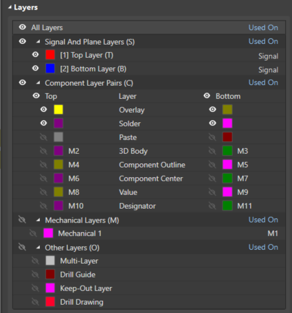
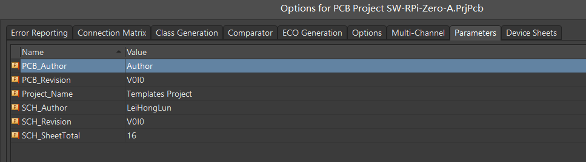
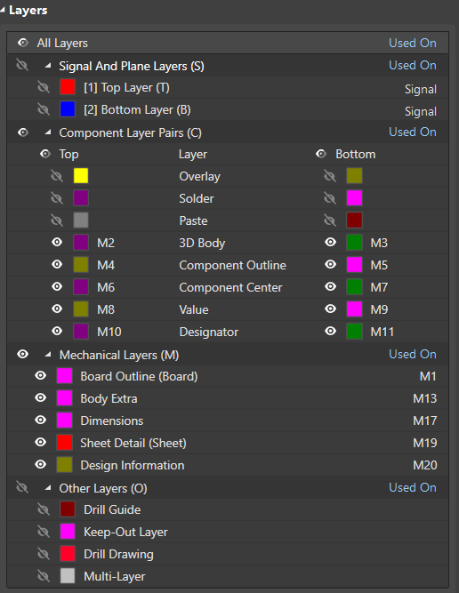

# AD-Templates
## Component Libraries | 元件库
### Schematic Lib | 原理图库
### PCB/Footprint Lib | PCB库
>* **Component Layer Pairs | 元件机械层**
 > - Top/Bottom = M2/M3 -- 3D Body | 元件3D模型层
 > - Top/Bottom = M4/M5 -- Component Outline | 元件外形层
 > - Top/Bottom = M6/M7 -- Component Center | 元件中心层
 > - Top/Bottom = M8/M9 -- Value | 元件参数层(Bodoni MT Condensed)
 > - Top/Bottom = M10/M11 -- Designator | 元件标号层(Consolas)  
  
## PCB Project | PCB项目
### Project Parameters | 项目参数
>* **Project**
 > - Project_Name = Name | 项目名
 > - My_Company = Company
 > - My_Organization = Org
> * **PCB**
 > - PCB_Revision = V0I0 | PCB版本号
 > - PCB_Author = Author | PCB设计者
>* **Schematic**
 > - SCH_Revision = V0I0 | 原理图版本号
 > - SCH_SheetTotal = TotalNum | 原理图总数
 > - SCH_Author = Author | PCB设计者  
  
### PCB Meachincal Layers | PCB 机械层定义
>* **Component Layer Pairs | 元件机械层**
 > - Top/Bottom = M2/M3 -- 3D Body | 元件3D模型层
 > - Top/Bottom = M4/M5 -- Component Outline | 元件外形层
 > - Top/Bottom = M6/M7 -- Component Center | 元件中心层
 > - Top/Bottom = M8/M9 -- Value | 元件参数层
 > - Top/Bottom = M10/M11 -- Designator | 元件标号层
>* **Other Meachincal Layers | 其他机械层**
 > - M1 -- Board Outline | PCB板外形层
 > - M13 -- Body Extra | 额外3D模型层
 > - M17 -- Dimensions | 测量信息层
 > - M19 -- Sheet Detail | 图纸信息层
 > - M20 -- Design Informaiton | 设计制造信息层  
  
