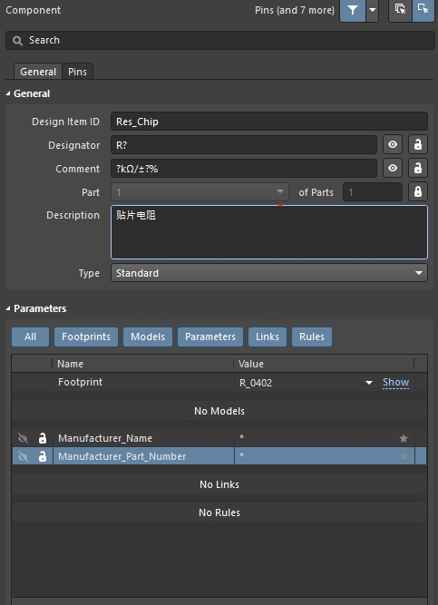

# Altium-Designer-Libraries
## 主要内容
* **3D模型**
  - [3D ContentCentral](https://www.3dcontentcentral.cn) (全类3D模型资源网站)
  - [BOURNS](https://www.bourns.com/home) (主要无源器件)
  - [TE Connectivity](https://www.te.com.cn/chn-zh/home.html) (连接器、无源器件电阻电容..)
  - [J.S.T Connector](https://www.jst-mfg.com/index_e.php) (连接器)  

* **PcbLib (参考)**  

* **SchLib (参考)**    
* **AD-Snippets (原理图模块)**$
* **AD-Template (模板：工程、原理图、PCB、BOM、机械层定义、拼板..)**
* **AltiumLL (PCB封装工具-辅助)**
* **Integrated-Libary (使用中)**
* **芯片之家-3D集成库 (参考移植库)**

## Intergrated-Libary （使用中）介绍：
### IntLib 使用
  1. **文件位置：文件夹 < _IntLibPkg >**  
  2. **打开.LibPkg工程，并执行 < Compile Integrated Library >**

### 元件分类-5大类
* **Passive.LibPkg 被动器件（通用器件）[器件标号 Designator]**  
  - Cap 电容 [C]
  - Res 电阻 [R]
  - Ind 电感 [L]
  - Fuse 保险丝 [F]
  - Filter 滤波器 [FL]  

* **Active.LibPkg  主动器件（通用器件）[器件标号 Designator]**  
  - BJT 双极性晶体管（三极管）[Q]
  - Buzzer 蜂鸣器 [B]
  - Crystal 晶振 [X]
  - Diode 二极管 [D]
  - MOSFET MOS管 [Q]
  - Relay 继电器 [R]  

* **Connector.LibPkg 连接器（通用器件）[器件标号 Designator: J]**
  - USB
  - HDMI
  - Micro SD（TF）
  - Audio 音频座子
  - DC 电源座子
  - Ethernet 网口座子
  - FemaleHeader 排母
  - PinHeader 排针
  - PH
  - ....(更多移植,芯片之家-3D集成库)

* **IC.LibPkg 芯片(按公司名分类) [器件标号 Designator: IC]**
   - TI
   - ADI
   - ST
   - Silergy
   - ...(更多移植,芯片之家-3D集成库)  

* **Module.LibPkg 模块 [器件标号 Designator: 根据Module封装灵活使用：J、U、Module..]**
   - RF 射频模块（3G、4G、RFID..）
   - RaspberryPi 树莓派模块（CM3、CM4、GPIO-40Pin.. ）
   - ...(更多移植,芯片之家-3D集成库)  

* **MiscPart.LibPkg(PCB标识、安装孔、测试点、Mark点..)**

### 制作原理图库（Symbol）
* **Altium Designer -> Tools -> SymbolWizard （使用AD中Symbol生成工具）**  
   - Design Item ID : 元件类型+封装类型 命名（参考现有命名格式：Res_Chip、Ind_Chip、Ind_WireWound..）
   - Designator ：(参考<元件分类>标号描述)
   - Comment ：主要参数(10uH/1A) 或 原厂型号(stm32f103f8t6)
   - Description: 简要描述器件类型(DC-DC、放大器、DAC芯片..)
   - Parameters ：Manufacturer_Name、Manufacturer_Part_Number （元件厂家名、元件原厂编号）
   

* **[AltiumLL 官方链接](https://www.samacsys.com/altium-designer-library-instructions/) 使用AltiumLL工具**

### 制作PCB库（Footprint）
* **元器件封装命名**
   - 常用Chip封装：R_0603、C_0603、L_0603、LED_0603..
   - 常用芯片封装：封装类型-引脚数_可选引脚信息.(SOT23-3、LQFP-48、QFN-38、TSSOP-20..)
   - 连接器封装(常规)：器件类型-引脚数+封装类型(卧式、立式、直角、弯脚、贴片、过孔..) (PH2.0-4PWB、MX1.25-3P),或是按厂家型号命名(HDMI-019A)

* **Altium Designer -> IPC Compliant Footprint Wizard (使用AD中封装生成工具)**

* **使用AltiumLL工具 [AltiumLL 官方链接](https://www.samacsys.com/altium-designer-library-instructions/)**
* **机械层定义 [Altium 官方文档](https://www.altium.com/documentation/altium-designer/working-with-mechanical-layers-ad?version=19.1)**
   - M1 Board Outline 板外形   
   - M2-M3 Components 3DBody 3D模型（IPC标准 必须）   
   - M20-M21 Assembly 元件大致外形及方向标识（IPC标准 必须）  
   - M6-M7 Components Center  元件中心
   - M4-M5 Components Outline  元件外形
   - M14-M15 Courtyard 元件安装所需空间+中心标识，接插件可添加插入线材空间如HDMI，USB (IPC标准 必须)   
   - M10-M11 Designator (强烈建议：生产贴片用)
     - 字体与大小：Bodoni MT Condensed; 0.8mm 1mm 1.5mm 2mm 3mm 5mm 
   - M8-M9 Value (建议：样板焊接,调试)
     - 字体与大小：Bodoni MT Condensed; 0.8mm 1mm 1.5mm 2mm 3mm 5mm 
